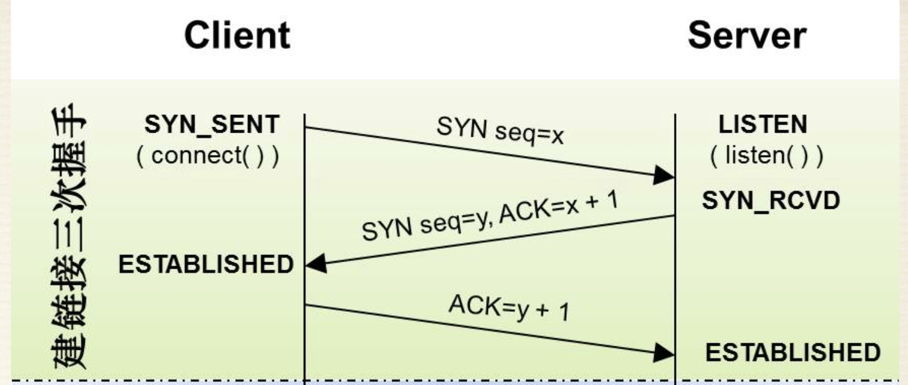
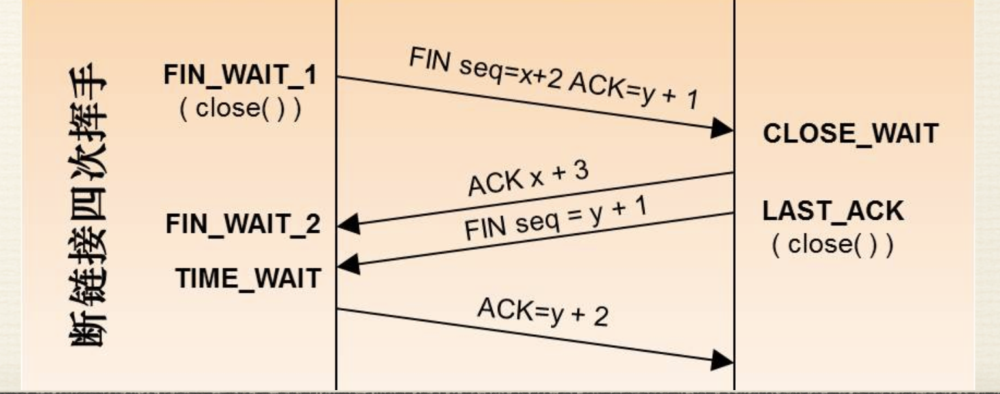

# TCP/IP
TCP/Ip 是互联网相关的各类协议族的总称,而 HTTP 属于它内部的一个子集。

# TCp/Ip 的分层管理

TCP/IP 协议族按层次分别分为以下4层:应用层、传输层、网络层和数据链路层。

**分层的好处**
- 如果互联网只由一个协议统 筹，某个地方需要改变设计时，就必须把所有部分整体替换掉。而分 层之后只需把变动的层替换掉即可。把各层之间的接口部分规划好之 后，每个层次内部的设计就能够自由改动了
- 层次化之后,设计也变得相对简单了

## 应用层

应用层决定了 想用户提供应用服务时通讯的活动

**TCP/IP** 协议族内预存了各类通用的应用服务.如: **FPT(文件传输协议)**, **DNS(域名系统)** 服务

> HTTP 协议也处于改层

## 传输层
传输层对上层应用层,提供处于网络连接中的两台计算机之间的数据传输.

在传输层有两个性质不同的协议: **TCP(传输控制协议)** 和 **UDP(用户数据报协议)**

## 网络层

网络层用来处理在网络上流动的数据包。数据包是网络传输的最小数 据单位。该层规定了通过怎样的路径（所谓的传输路线）到达对方计 算机，并把数据包传送给对方。

与对方计算机之间通过多台计算机或网络设备进行传输时，网络层所 起的作用就是在众多的选项内选择一条传输路线。

## 链路层

用来处理连接网络的硬件部分。包括控制操作系统、硬件的设备驱 动、NIC（Network Interface Card，网络适配器，即网卡），及光纤等 物理可见部分（还包括连接器等一切传输媒介）。硬件上的范畴均在 链路层的作用范围之内

# TCP/IP 通信传输流

发送端在层与层之间传输数据时，每经过一层时必定会被打上一个该 层所属的首部信息。反之，接收端在层与层传输数据时，每经过一层 时会把对应的首部消去。

这种把数据信息包装起来的做法称为 **封装**（encapsulate）。

# TCP 协议

TCP 位于传输层,提供可靠的字节流服务

**字节流服务**:为了方便传输,讲大块数据分隔 成以报文段为单位的数据包进行管理,并且 TCP 协议能够确认数据最终能否送达到对方

为了 准确无误地讲数据送达到目标处, **TCP**协议采用了三次握手策略。 用 TCP 协议把数据包送出去后, TCP 一定会向对方确认是否成功送到

## TCP 三次握手

握手使用了 **TCP** 的标志  **SYN** 和 **ACK**

- 发送端首先发送一个带 **SYN**标志的数据包给对方.
- 接收端收到后,回传一个带有 **SYN/ACK** 标志的数据包以表示传达确认信息。 
- 最后发送端再回传一个带有 **ACK** 标志的数据包,代表 **握手** 结束

### 为什么要进行三次握手
- 在发送报文之前客户端和服务端都要确认可以进行连接. 之所以进行三次握手,是为了信息传输的可靠性,如果其实某个握手失败,这个过程会重复
- 如果采用两次握手,相当于第二次握手结束便建立连接, 如果 客户端一方不想连接了，也不会有反馈,则客户端缺一直在等待，浪费时间。当然也可以建立 4次,不过建立次数太多,建立连接的时间太长，效果也会大打折扣。所以3次只是折中方案，保证了可靠性，又节俭了建立连接的时间。

>如在握手过程中某个阶段莫名其妙的中断,TCP 协议会再次以相同的顺序发送相同的数据包

## 四次挥手

- 客户端发送 **Fin+Ack** 报文,表示关闭数据传输,发送端进入 **FIN_WAIT** 状态,表示没有数据要传输了
- 服务端收到 FIN 报文后进入 **CLOSE_WAIT** 状态(被动关闭),然后发送 **ACK**确定,表示同意关闭请求,客户端进入到 **FIN_WAIT_2**
- 服务端等待数据发送完,再次发送 FIN 到客户端 请求关闭,服务端进入 **LAST_ACK** 状态
- 客户端收到服务端发送的 FIN 后,回复 **ACK** 到服务端,客户端进入 **TIME_WAIT**.状态 服务端接受到客户端发送的 **ACK**后就关闭连接,状态为 **CLOSED**. 客户端等待 **2MSL** 没有收到服务端的回复,说明服务端已经正常关闭了,服务端关闭连接。

### 为什么客户端发送 ACK 后要等待 2MSL 而不是直接关闭

- 保证客户端发送的 **ACK** 报文能够到达服务器，从而保证 tcp 能够可靠的关闭
如果客户端发送完马上关闭,一旦 **ACK** 丢失,服务端就会一直处于等待关闭确认的状态, 超时后再次发送关闭请求,此时客户端已经关闭,服务端无法进行正常的关闭

- 保证此次连接的数据段消失,防止失效的数据段

客户端在发送ACK后，再等待2MSL时间，可以使本次连接所产生的数据段从网络中消失，从而保证关闭连接后不会有还在网络中滞留的数据段去骚扰服务端；

- 2MSL的等待时间

我们知道服务端收到ACK，关闭连接。但是客户端无法知道ACK是否已经到达服务端,于是开始等待？等待什么呢？假如ACK没有到达服务端，服务端会为FIN这个消息超时重传 timeout retransmit ,那如果客户端等待时间足够,又收到FIN消息，说明ACK没有到达服务端，于是再发送ACK，直到在足够的时间内没有收到FIN,说明ACK成功到达。这个等待时间至少是：服务端的timeout + FIN的传输时间，为了保证可靠，采用更加保守的等待时间2MSL。

