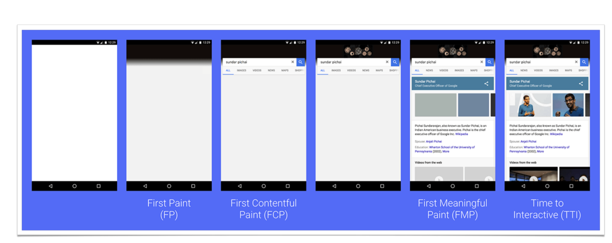
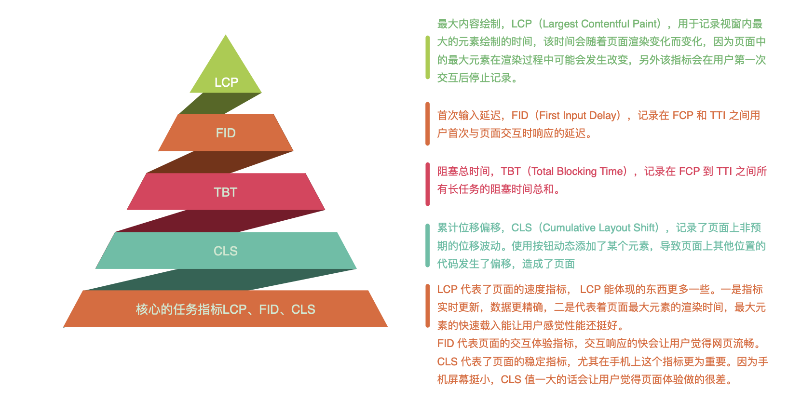
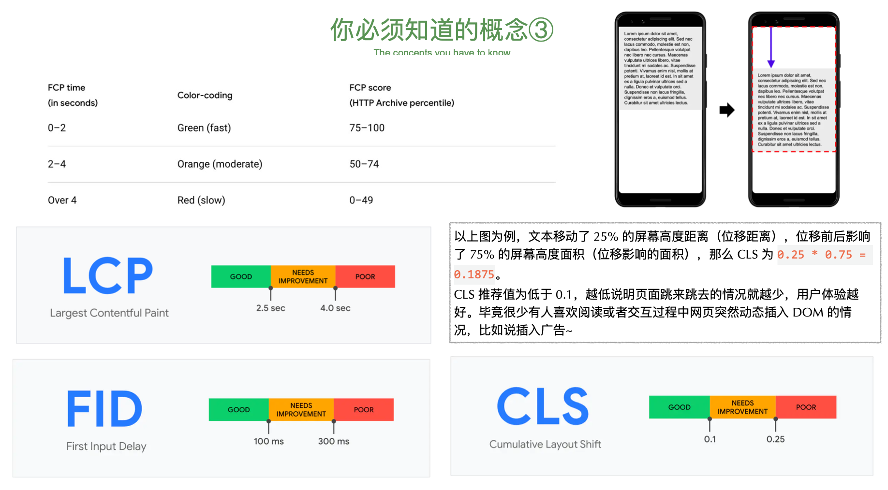

# 各项指标的意义





## FP

**FP** 全称 **First Paint**:首次绘制,是时间线上的第一个时间点，它代表网页的第一个像素渲染到屏幕上所用时间，也就是页面在屏幕上首次发生视觉变化的时间。

## FCP
*FCP**,全称 **First Contentful Paint**:首次内容绘制,顾名思义,它代表浏览器第一次向屏幕绘内容。

注意:
**注意只有首次绘制文本、图片（包含背景图）、非白色的canvas或SVG时才被算作FCP**

## FMP
**FMp**,全称 **First Meaningful Paint**:首次有意义的绘制。是页面主要内容出现在屏幕上的时间, 这是用户感知加载体验的主要指标。目前尚无标准化的定义, 因为很难以通用的方式去确定各种类型页面的关键内容。


## TTL
**TTl**,全称**Time To Interactive**, 可交互时间,推荐的响应时间是 100ms 以内否则有延迟感.是衡量应用加载所需时间并能够快速响应用户交互的指标

## Long tasks
这里的longtask是以50ms为临界值得出的，任务执行时间超过50ms就会被归为longtask。


**总结**


## 新一代WEB指标




**概念**




这些指标包括加载体验、交互性和页面内容的视觉稳定性,分别是 **LCP**,**FID**,**CLS**

### LCP

**LPC** 全称 Largest Contentful Paint,用于衡量标准报告视口内可见的最大内容元素的渲染时间。为了提供良好的用户体验，网站应努力在开始加载页面的前 2.5 秒内进行 最大内容渲染 

相比 FCP ，这个指标就非常有价值了，因为这个值是根据页面加载渲染不断变化的，如果页面有一个 lodaing 动画，然后才渲染出具体内容，那么这个指标计算出来的就是具体内容的加载速度，而非 lodaing 动画的加载速度。

**LCP考虑哪些元素**

LCP 目前并不会计算所有元素，因为这样会使这个指标变得非常复杂，它现在只关注下面的元素：

- img 元素
- image元素内的 svg元素
- video 元素
- 通过 url() 函数加载背景图片的元素
- 包含文本节点或其他内联文本元素子级的块级元素

### FID

**FID** First Input Delay:即记录用户和页面进行首次交互操作所花费的时间 。FID 指标影响用户对页面交互性和响应性的第一印象。为了提供良好的用户体验，站点应努力使首次输入延迟小于 100 毫秒。

FID 发生在 FCP 和 TTI 之间，因为这个阶段虽然页面已经显示出部分内容，但尚不具备完全的可交互性。这个阶段用户和页面交互，往往会有较大延迟。

例如:浏览器接收到用户输入操作时,主线程正在忙于执行一个耗时比较长的任务，只有当这个任务执行完成后，浏览器才能响应用户的输入操作。它必须等待的时间就此页面上该用户的 FID 值。

这个时候我们可以使用 **Web Worker**开启一个单独的线程中执行费时的处理任务，从而允许主（通常是UI）线程运行而不被阻塞。将非 UI 操作移至单独的工作线程可以减少主线程的阻塞时间，从而改善 FID

### CLS

CLS 会测量在页面的整个生命周期中发生的每个意外的样式移动的所有单独布局更改得分的总和。布局的移动可能发生在可见元素从一帧到下一帧改变位置的任何时候。为了提供良好的用户体验，网站应努力使 CLS 分数小于 0.1 。

**不要使用无尺寸元素**

图像和视频等元素上始终需要包括 width 和 height 尺寸属性，现代浏览器会根据图像的 width 和 height 属性设置图像的默认长宽比，知道纵横比后，浏览器就可以为元素计算和保留足够的空间。

或者，使用 aspect-ratio 也可以提前指定宽高比：

```css
img {
    aspect-ratio: attr(width) / attr(height);
}
```

那响应式的图片呢？可以使用 srcset 定义图像，使浏览器可以在图像之间进行选择，以及每个图像的大小。

```css

```

- 永远不要在现有内容之上插入内容，除非是响应用户交互。这确保了预期的布局变化
- 很多页面广告都是动态插入的，所以一定要提前为广告位预留一定空间。


## 如何统计

可以利用 **PerformanceObserver** 来检测性能指标,如下:

```html
<!DOCTYPE html>
<html lang="en">

<head>
    <meta charset="UTF-8">
    <meta name="viewport" content="width=device-width, initial-scale=1.0">
    <title>获取各种指标</title>
    <link rel="stylesheet"
        href="https://cdn.staticfile.org/twitter-bootstrap/5.0.0-alpha1/css/bootstrap-reboot.min.css" />
</head>

<body>
    <div id="app">
        <h1>aotu</h1>
    </div>

    <script>
        const observer = new PerformanceObserver((list) => {
            for (const entry of list.getEntries()) {
                console.log(entry.name);
                console.log(entry.startTime);
                console.log(entry.duration);
                console.log(entry.entryType);
            }
        });
        observer.observe({ entryTypes: ['paint', 'resource', 'mark'] });
    </script>
    <script>
        performance.mark('xikun')
    </script>
</body>

</html>
```

**entryTypes** 有如下几种:

| 属性        | 含义           
| ------------- |:-------------:|
| mark         | 通过 performance.mark()  | 
| measure      | 通过 performance.measure()      |  
| resource     | 资源时间      |   
| frame, navigation   | 文件的地址      |  
| paint | 获取绘制的时间,主要是 first-paint 和 first-contentful-paint |  
| longtask | 在浏览器执行超过 50ms 的任务      |  

使用框架 **web-vitals**

可以通过 npm 安装包使用 也可以直接使用 

```html
<script type="module">
    import { getCLS, getFID, getLCP } from 'https://unpkg.com/web-vitals@0.2.4/dist/web-vitals.es5.min.js?module';

    getCLS(console.log);
    getFID(console.log);
    getLCP(console.log);
</script>
```

更多详细移步:[web-vitals](https://www.npmjs.com/package/web-vitals)

## performance.timing
通过 **performance.timing** 可以获取浏览器的各项指标信息


```html
<script>
  let t = performance.timing;
  console.log(
    'DNS查询耗时 ：' + (t.domainLookupEnd - t.domainLookupStart).toFixed(0)
  );
  console.log('TCP链接耗时 ：' + (t.connectEnd - t.connectStart).toFixed(0));
  console.log(
    'request请求耗时 ：' + (t.responseEnd - t.responseStart).toFixed(0)
  );
  console.log(
    '解析dom树耗时 ：' + (t.domComplete - t.domInteractive).toFixed(0)
  );
  console.log('白屏时间 ：' + (t.responseStart - t.navigationStart).toFixed(0));
  console.log(
    'domready时间 ：' +
      (t.domContentLoadedEventEnd - t.navigationStart).toFixed(0)
  );
  console.log(
    'onload时间 ：' + (t.loadEventEnd - t.navigationStart).toFixed(0)
  );

  if ((t = performance.memory)) {
    console.log(
      'js内存使用占比 ：' +
        ((t.usedJSHeapSize / t.totalJSHeapSize) * 100).toFixed(2) +
        '%'
    );
  }
</script>
```

## 白屏的产生


**FP**


**FCP/FMP**


## 思考
如果做一个小型的**监控系统**?

- 通过上述的方法拿到自己想要的指标
- 去服务器上请求 一个 1KB 大小的图片 并带上这些指标参数
- 使用 navigator.sendBeacon() 发送
- Node 读取服务器日志 过滤有效的接口
- 对接口参数整理并进行分析
- 开启定时任务每天凌晨12.00 开始读取数据并绘制出图表

::: tip
为什么使用 **navigator.sendBeacon()** 进行发送
:::

**navigator.sendBeacon()** 方法可用于通过HTTP将少量数据异步传输到Web服务器 而不占用进程

发送可以使用的优先级
1. navigator.sendBeacon()
2. ajax
3. fetch
